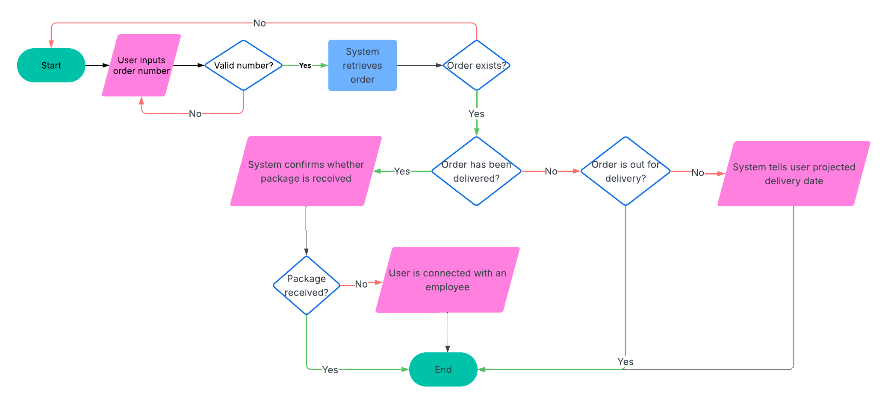
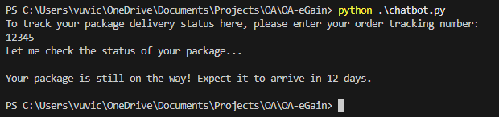
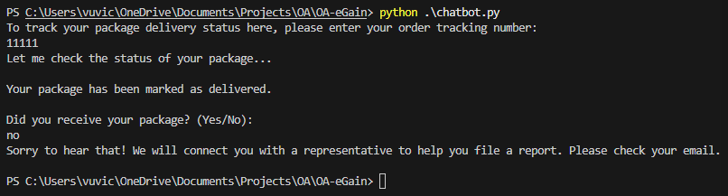
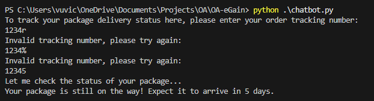
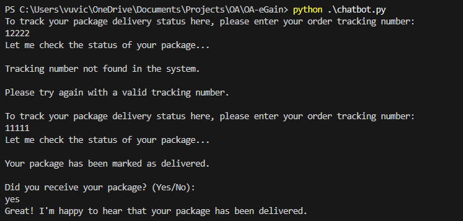

# Package-tracking Chatbot Prototype
## Setup
### Dependencies
This prototype was developed on Python 3.13.2. However, it should also work for previous versions. It also makes use of standard python libraries **time** and **random**, which require no additional setup.
### Setup and Installation
Clone this repository and run **chatbot.py** in your terminal. 
## Development Approach and Decisions
### Design Philosophy
For this chatbot, I based the conversation and decision flow on the package-tracking process used by popular e-commerce sites like amazon.com, particularly drawing inspiration from the way that they define their delivery stages. I began by defining user inputs and outputs in the process of tracking a package, and defined by function signatures based on the actions that an imaginary customer service employee would need to take in order to move forward with the conversation. This philosphy allows me to isolate each action to a single function, which promotes the single responsibility principle. 

### Refactoring 
#### Recursion and Error Handling 
Initially, I handled invalid user inputs using by calling the function that prompted the user until the system receives a valid input. However, the recursion introduced bugs and additional overhead, so I opted for a loop instead.

I also opted to explicitly define my errors, which helped me understand where each error should be handled. Initially, when check_status failed to find a package with a given tracking number, it raised a KeyError, which was caught by chatbot(). However, I instead opted to change it to an abstracted PackageStatusError to abstract chatbot() away from the details of any data access operations performed by check_status(). Now, I rewrite check_status() to access a database instead of a dictionary of dummy values without changing the behavior of any functions that depend on it.
## Conversation and Decision Flows
### Flowchart
The flowchart below illustrates the possible decision flows based on user input and data.

### Example Conversations
#### Package is in transit

#### Package is delivered but missing

#### User provides invalid tracking number

#### Package with given tracking number does not exist

